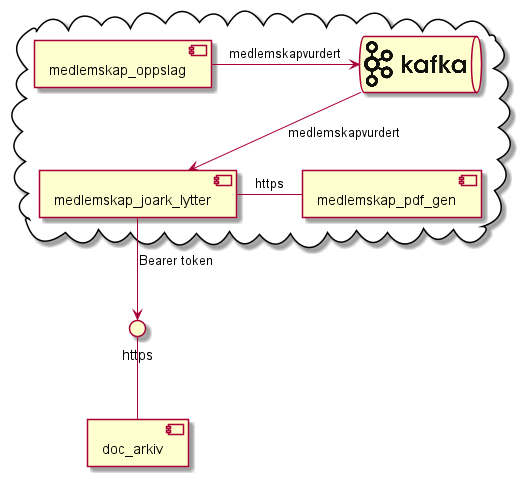
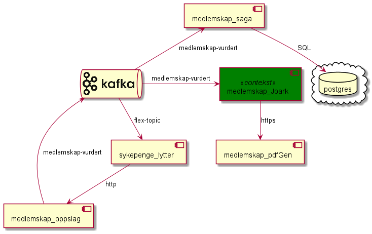

# medlemskap-joark
NAIS applikasjon som 
1. Lytter på kafka kø til medlemskap-oppslag som inneholder resultat av regelkjøring
2. Parser kafka melding og konverterer til dto
3. Oppretter et dokument (pdf) via rest kall mot medemskap-oppslag-pdf med dto som input
4. Registrerer nytt dokument (pdf fra steg 2) i JOARK via rest kall mot JOARK

# Testing
Tjenesten testes kun med Junit tester 
* JaksonMapperTest tester parsing av melding fra kafka topic. Kilde er både fil (eksemepl melding) 
samt at en test også leser forventet respons fra medlemslap-oppslag tester (kontrakts testing)
* JoarkService test tester mappingen til request obketet for Joark

# kjøring lokalt
komponenten kan startes lokalt så fremst man har de korrekte key store og trust store satt opp lokalt.

Merk at det ikke er lagt opp til støtte fo

# Avhengigheter
* Kafka
* Medlemskap-pdfGen

# UseCase diagram

# Value Chain diagram

